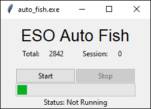

# About the project
<p align="center">
    
</p>
An automatic casting/catching tool to afk fish in the elder scrolls online.
</br>

# Running the Script

Creating the venv and installing packages only required on initial setup/run.  
**virtual environment will still need to be activated each time before running*

Create a virtual environment and activate it (optional):
```sh
$ python -m venv venv
$ venv/Scripts/activate
```
Install the required packages (required):
```sh
$ pip install -r requirements.txt
```
Run the main file:
```sh
$ python main.py
```
</br>

# Using the Tool

The tool will always remain on top of other active windows. Edit the config file with the position values from the fishing addon saved variables file to ensure it checking the correct area of the screen. Press start and the tool will begin fishing as soon as your cursor hovers over an active fishing spot. To change bait, you will need to stop the tool with stop button, change bait type, and start the tool again.

The tool uses random wait times between a chosen min and max to appear more like a real player. It won't react faster than a human, and the maximum is set to a point where it will occasionaly (~2% of the time) fail to perform an action in time and lose the fish.
</br>